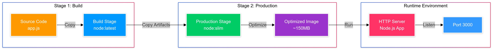

# 🚀 Node.js Multi-Stage Build Optimization

[](https://github.com/TheToriqul/multi-stage-nodejs-build)


## 📋 Project Overview

This project demonstrates advanced Docker containerization techniques through a practical implementation of multi-stage builds for Node.js applications. By leveraging multi-stage builds, I've created a streamlined containerization process that significantly reduces image size and enhances deployment efficiency while maintaining robust functionality.

## 🎯 Key Objectives

- Implement efficient multi-stage Docker builds for Node.js applications
- Optimize container image size through strategic layer management
- Demonstrate professional-grade containerization practices
- Create a secure and production-ready deployment pipeline
- Establish a reusable pattern for Node.js application containerization

## 🏗️ Project Architecture
The architecture implements a Docker multi-stage build process that first copies the Node.js source code into a build stage using the full node:latest image. Then, for optimal production deployment, it transfers only the necessary artifacts to a lightweight node:slim image, resulting in a significantly smaller final image (~150MB) that runs a simple HTTP server on port 3000.
<figure >
  <p align="center">
      
      <p align="center">Docker Multi-Stage Build Node.js Architecture</p> 
  </p>
</figure>

## 💻 Technical Stack

- **Runtime**: Node.js with HTTP server implementation
- **Containerization**: Docker multi-stage builds
- **Base Images**: 
  - Build: node:latest
  - Production: node:slim
- **Networking**: Exposed port 3000

## 🚀 Getting Started

<details>
<summary>🐳 Prerequisites</summary>

- Docker Engine 20.10.x or higher
- Node.js 14.x or higher (for local development)
- Git for version control
</details>

<details>
<summary>⚙️ Installation</summary>

1. Clone the repository:
   ```bash
   git clone https://github.com/TheToriqul/multi-stage-nodejs-build.git
   cd multi-stage-nodejs-build
   ```

2. Build the Docker image:
   ```bash
   docker build -t node-app .
   ```

3. Run the container:
   ```bash
   docker run -d -p 3000:3000 node-app
   ```
</details>

<details>
<summary>🎮 Usage</summary>

1. Access the application:
   ```bash
   curl http://localhost:3000
   ```

2. View container status:
   ```bash
   docker ps
   ```

For detailed commands and operations, refer to the [reference-commands.md](reference-commands.md) file.
</details>

## 💡 Key Learnings

### Technical Mastery:

1. Advanced Docker multi-stage build optimization
2. Container layer management and caching strategies
3. Production-grade Node.js containerization
4. Efficient Docker image size reduction techniques
5. Container security best practices

### Professional Development:

1. DevOps workflow optimization
2. Containerization strategy planning
3. Production deployment considerations
4. Performance optimization techniques
5. Documentation and knowledge sharing

## 🔄 Future Enhancements

<details>
<summary>View Planned Improvements</summary>

1. Implement health check mechanisms
2. Add Docker Compose for multi-container setup
3. Integrate CI/CD pipeline configuration
4. Add monitoring and logging solutions
5. Implement container orchestration support
6. Add automated testing framework
</details>

## 🙌 Contribution

Contributions are welcome! Feel free to [open an issue](https://github.com/TheToriqul/multi-stage-nodejs-build/issues) or submit a [pull request](https://github.com/TheToriqul/multi-stage-nodejs-build/pulls) to suggest improvements or add features.

## 📧 Connect with Me

- 📧 Email: toriqul.int@gmail.com
- 📱 Phone: +65 8936 7705, +8801765 939006
- 🌐 LinkedIn: [@TheToriqul](https://www.linkedin.com/in/thetoriqul/)
- 🐙 GitHub: [@TheToriqul](https://github.com/TheToriqul)
- 🌍 Portfolio: [TheToriqul.com](https://thetoriqul.com)

Let's connect and discuss all things DevOps and containerization!

---

Thank you for exploring this project! I hope you find these containerization techniques valuable for your own projects. Happy containerizing! 🐳